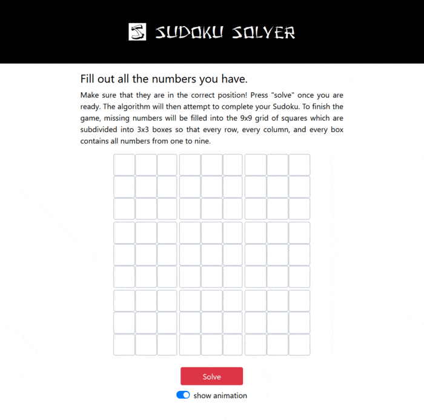

# Sudoku Solver
This webapp made with Node.js, React and Bootstrap. You can use the Sudoku Solver to input the numbers of a Sudoku puzzle and let the algorithm solve it. To finish the game, missing numbers will be filled into the 9x9 grid of squares which are subdivided into 3x3 boxes so that every row, every column, and every box contains all numbers from 1 to 9.
<br><br>

## Web App ##
You can find the <b><a href="https://gh28942.github.io/sudoku-solver/">web application here</a>.</b>
<br><br>

<!--## Video Demo ##
<p align="center">
	<a href="https://www.youtube.com/watch?v=P0FcoEb87cU" target="_blank" rel="noopener noreferrer">
		
	</a>
</p>-->
											  
## Screenshots ##
<p align="center">
  
</p>
<p align="center">Solving a Sudoku game using the webapp. Once solved, a user can pick each space and see its associated spaces highlighted.</p>
<br><br>

## Strategy ##
In every step/iteration of the algorithm, two different strategies are used:
<ul>
<li>Look at every space and fill it out if there's only one number (from 1-9) allowed in it. Use this strategy as often as possible.</li>

<li>If there are no spaces with only one choice left, pick the space with the smallest amount of possible digits and choose one of them. If at some point no free spaces can be filled out, roll back to the first occurance of this strategy and try again.</li>
</ul>
This strategy will solve a Sudoku in between a dozen to a few dozen milliseconds.
<br><br>

## Commands - Install & Usage ##
Run the app locally:<br>
// Nodejs API (Terminal 1) 
```
cd api
npm run dev
```
// React app (Terminal 2)
```
cd my-app
npm start
```
<br><br>
Push the web app to a Github page:
```
cd my-app
npm install gh-pages --save-dev
git init
git remote add origin https://<token>@github.com/<username>/<repository-name>.git
npm run deploy
```
<br><br>

## Credits ##
Sound effects obtained from <a href="https://zapsplat.com">zapsplat.com</a> (Standard Licence)<br>


